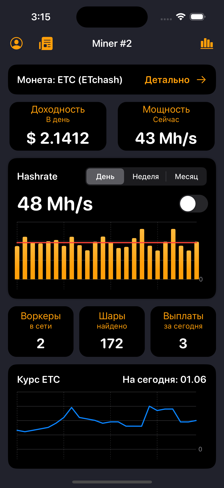

# Readme для приложения MineCharts

MineCharts - это приложение на iOS, разработанное для анализа данных криптомайнинга. С помощью этого приложения пользователи могут получать графики и статистику по различным криптовалютам и майнинговым пулам.

<html>
 <body>
  

    
  

 </body>
</html>

## Использование

MineCharts предоставляет пользователям широкий спектр функций для анализа данных криптомайнинга. Вот некоторые основные функции:

- **Графики криптовалют**: приложение позволяет просматривать графики цен на различные криптовалюты в режиме реального времени. Пользователи могут выбрать интересующую их криптовалюту и просмотреть ее динамику изменения цены.
- **Статистика майнинговых пулов**: MineCharts предоставляет информацию о различных майнинговых пулах, включая их активность, скорость и выплаты. Пользователи могут отслеживать работу разных пулов и принимать решения на основе полученной информации.
- **Отчеты и аналитика**: приложение предоставляет возможность создавать отчеты и анализировать данные криптомайнинга. Пользователи могут получать информацию о своей активности, доходности и эффективности работы.

## Требования

Для использования приложения MineCharts требуется устройство с операционной системой iOS 16 или более поздней версии. Рекомендуется использование последней доступной версии iOS для обеспечения стабильной работы приложения.
